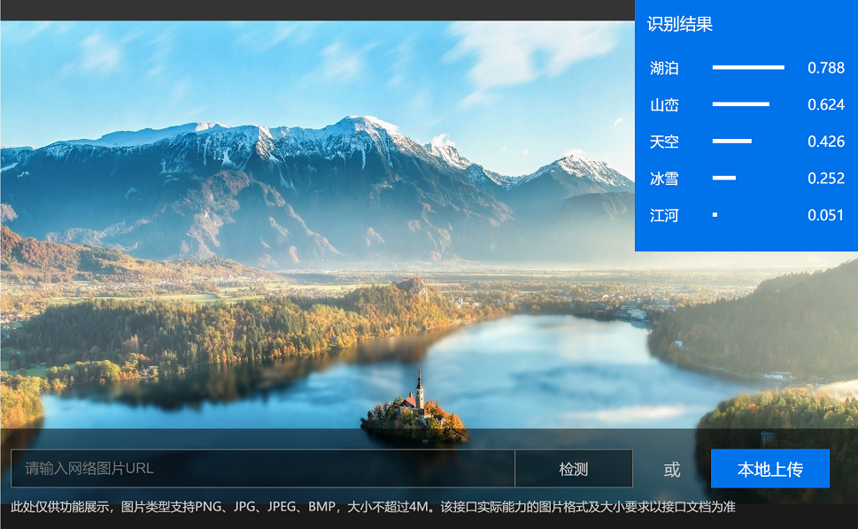
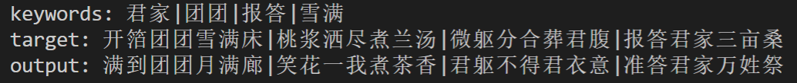

### 作品名称：《诗情画意》

AI自动识别上传的图片并生成诗歌，进行配图

#### 图片的识别——功能已经实现

##### step 1 : 安装依赖


```
pip install requirements.txt
```
##### step 2 : 开启服务
```
cd codes/
python3 serve.py
```



#### 关键字生成诗歌——功能正在调试



#### 诗歌+图片——前端正在做

#### 诗歌匹配滤镜——风格迁移